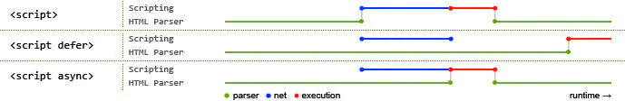

# Questions

## HTML

::: details 行内元素和块级元素
- 行内元素：行内元素通常用于包裹文本中的一部分内容，它们不会导致换行，且只占据其包含的内容的宽度。常见的行内元素包括`<span>`、`<a>`、`<strong>`、`<em>`等。
- 块级元素：块级元素通常用于包裹页面上的结构化内容，它们会导致换行，并且会占据其父元素的整个宽度。常见的块级元素包括`<div>`、`<p>`、`<h1>`、`<ul>`、`<li>`等。
:::

::: details script 标签的加载问题

浏览器解析 HTML 文档遇到外联脚本或样式时会先暂停文档的解析, 等待资源下载完成并执行后再继续文档的解析。

- defer: 解析遇到脚本则开启新的线程下载脚本文件, 并在文档解析完成后执行。脚本按照先后顺序执行, 且在 DOMContentLoaded 事件前执行, 但现实不一定。
- async: 解析遇到脚本则开启新的线程下载脚本文件, 下载完成后立即执行, 不保证按照先后顺序执行。

:::

::: details 语义化标签
`<header>`：表示页面或区域的页眉。通常包括标题、标志和导航。

`<nav>`：定义导航菜单。用于包装网站上的导航链接。

`<main>`：包含文档的主要内容。最好在页面上只有一个 `<main>` 元素。

`<article>`：表示可独立分发和重用的自包含内容，如博客文章或新闻文章。

`<section>`：表示主题相关的内容组。有助于将页面的内容组织成不同的部分。

`<aside>`：表示与周围内容有切实关系的内容。通常用于侧边栏或引文。

`<figure>` 和 `<figcaption>`：用于嵌入图像、图表或视频，可选择包含标题。用于为媒体内容提供上下文。

`<footer>`：表示页面或区域的页脚。通常包括版权信息、相关页面的链接或联系方式。

`<time>`：表示特定的时间段。有助于搜索引擎理解页面上的日期和时间信息。

`<address>`：表示最近的 `<article>` 或 `<body>` 祖先的联系信息。

`<mark>`：用于突出显示文本的某些部分。有助于标识重要的关键词或短语。

`<strong>` 和 `<em>`：用于文本格式化。`<strong>` 表示强调重要性，而 `<em>` 表示强调文本。

`<abbr>`：表示缩写或首字母缩写。有助于搜索引擎理解缩写的含义。

`<cite>`：表示创意作品的标题，如书名或电影名。用于引用引文。

`<blockquote>`：表示引自另一来源的引用段落。
:::

::: details link 或 @import 引入的 css 有什么区别

在 HTML 中引入 CSS 文件有两种主要的方式：使用 `<link>` 元素和使用 `@import` 规则。它们之间有几个关键的区别：

1. 加载方式：
`<link>` 元素是 HTML 标签，用于在 HTML 文件中直接引入外部 CSS 文件。它会在页面加载时并行加载 CSS 文件。
`@import` 规则是 CSS 的一种规则，用于在 CSS 文件中引入外部 CSS 文件。它会在 CSS 文件被解析时加载外部 CSS 文件。
2. 加载时机：
`<link>` 元素会在页面加载时立即加载和解析外部 CSS 文件，不会阻塞页面的加载。
`@import` 规则会在解析到该规则时才开始加载和解析外部 CSS 文件，这会导致页面的渲染被阻塞。
3. 兼容性：
`<link>` 元素是 HTML 的标准元素，几乎所有的浏览器都支持。
`@import` 规则是 CSS 的一部分，较早期的浏览器可能不支持或支持不完全。
4. 作用范围：
`<link>` 元素可以在 HTML 文件的 `<head>` 或 `<body>` 中使用，用于全局或局部的 CSS 文件引入。
`@import` 规则会在解析到它时立即发出请求加载引入的 CSS 文件，并且会阻塞后续样式的加载和渲染，直到引入的 CSS 文件加载完成并且解析完毕。
:::

## CSS

::: details BFC

区块格式化上下文（Block Formatting Context，BFC）是 Web 页面的可视 CSS 渲染的一部分，是块级盒子的布局过程发生的区域，也是浮动元素与其他元素交互的区域。

下列方式会创建块格式化上下文：

- 浮动元素（即 float 值不为 none 的元素）。
- 绝对定位元素（position 值为 absolute 或 fixed 的元素）。
- 行内块元素（display 值为 inline-block 的元素）。
- display 值为 flow-root 的元素。

利用格式化上下文可以解决问题：
- 包含内部浮动。
- 排除外部浮动。
- 阻止外边距重叠。

参考链接：
1. [区块格式化上下文](https://developer.mozilla.org/zh-CN/docs/Web/CSS/CSS_display/Block_formatting_context)

:::

::: details CSS 盒模型
CSS 盒子模型是一种用于布局和设计网页的模型，它将每个 HTML 元素视为一个矩形的盒子，这个盒子由内容、内边距、边框和外边距组成。盒子模型有两种模式：标准盒子模型和怪异盒子模型。

标准盒子模型：元素的内容宽度和高度仅包括内容区域。  
怪异盒子模型：元素的内容宽度和高度包括内容区域、内边距（padding）和边框（border）。

:::

::: details 类型选择器
CSS 选择器是用来选择页面上的元素，并为其应用样式的一种机制。它们可以根据元素的标签名、类名、ID 等不同的属性进行选择。

常见的 CSS 选择器类型包括：

1. 标签选择器（Tag Selector）：通过 HTML 元素的标签名进行选择，例如 div、p、a 等。

2. 类选择器（Class Selector）：通过 HTML 元素的 class 属性进行选择，以.开头，例如 .class-name。

3. ID 选择器（ID Selector）：通过 HTML 元素的 id 属性进行选择，以#开头，例如 #id-name。

4. 属性选择器（Attribute Selector）：通过 HTML 元素的属性进行选择，例如 [type="text"] 会选择所有 type 属性值为 text 的元素。

5. 伪类选择器（Pseudo-class Selector）：用于选择处于特定状态的元素，例如 :hover 用于选择鼠标悬停的元素、:first-child 用于选择第一个子元素等。

6. 伪元素选择器（Pseudo-element Selector）：用于选择元素的特定部分，例如 ::before 用于在元素之前插入内容、::after 用于在元素之后插入内容。

7. 组合选择器（Combination Selector）：将多个选择器组合在一起，以便选择满足多个条件的元素，例如 .class1.class2 可以选择同时具有 class1 和 class2 的元素。

优先级规则用于确定当多个选择器作用于同一个元素时，哪一个样式规则将被应用。通常，优先级的计算基于选择器的类型和数量，一般来说，优先级越高的规则越会被应用。

优先级可以用四个等级来表示：

1. 内联样式（Inline Styles）：直接在元素的 style 属性中指定的样式具有最高的优先级。

2. ID 选择器：ID 选择器具有比其他选择器更高的优先级，因为 ID 属性是唯一的。

3. 类选择器、属性选择器和伪类选择器：这些选择器具有比标签选择器更高的优先级，但比 ID 选择器低。

4. 标签选择器：标签选择器的优先级是最低的。
:::

::: details 伪类与伪元素
伪类（Pseudo-class）和伪元素（Pseudo-element）是 CSS 中用于选择元素特定状态或部分的选择器，它们的区别在于：

1. 伪类（Pseudo-class）：

用于选择处于特定状态的元素，例如鼠标悬停、被选中、访问过等。
伪类以冒号 : 开头，例如 :hover、:active、:visited。
伪类选择器一般用于选择已经存在于文档中的元素的特定状态。

2. 伪元素（Pseudo-element）：

用于选择元素的特定部分，例如元素的第一个字母、元素之前或之后插入的内容等。
伪元素以双冒号 :: 开头，例如 ::before、::after、::first-letter。
伪元素选择器用于在文档中生成或修改元素的内容，而不是选择已经存在的元素。

总的来说，伪类用于选择元素的状态，而伪元素用于选择元素的部分或生成内容。注意，尽管伪元素在语法上使用双冒号 :: 开头，但在 CSS2 中仍然允许使用单冒号 :，而在 CSS3 中规定了使用双冒号 ::，以区别于伪类。
:::

::: details 可以继承的样式

文本相关属性：
- font-family
- font-size
- font-weight
- line-height
- color
- text-align
- text-decoration
- white-space

其他属性：
- visibility
- cursor
:::

::: details display属性有哪些值？它们的作用是什么？
- none: 元素不显示，并从文档流中移除。
- block: 元素显示为块级元素。
- inline: 元素显示为内联元素。
- inline-block: 元素横向显示为内联元素，纵向显示为块级元素。
- flex: 元素变为弹性容器。
- grid: 元素变为网格容器。
:::

## JavaScript

::: details this
在 JavaScript 中，this 是一个特殊的关键字，用于引用当前执行上下文中的对象。this 的值在运行时动态确定，取决于函数是如何被调用的。

1. **全局上下文中的 this：** 在全局执行上下文中，this 指向全局对象，在浏览器中通常是 window 对象。

```js
console.log(this); // 在浏览器中输出：Window 对象
```

2. **函数中的 this：** 在函数中，this 的值取决于函数是如何被调用的。以下是几种常见情况：  
- 当函数作为独立函数调用时，this 指向全局对象。

```js
function exampleFunction() {
  console.log(this); // 在浏览器中输出：Window 对象
}

exampleFunction();
```
- 当函数作为对象的方法调用时，this 指向调用该方法的对象。

```js
var myObject = {
    name: "John",
    sayHello: function() {
        console.log(this.name); // 输出：John
    }
};

myObject.sayHello();
```

- 构造函数中的 this 当函数被用作构造函数（通过 new 关键字调用）时，this 指向新创建的对象。
```js
function Person(name) {
    this.name = name;
}

var john = new Person("John");
console.log(john.name); // 输出：John
```

- 使用 call 或 apply 明确指定 this：通过使用 call 或 apply 方法，可以明确指定函数执行时的 this 值。
```js
function greet() {
    console.log("Hello, " + this.name);
}

var person = { name: "John" };
greet.call(person); // 输出：Hello, John
```

3. **箭头函数中的 this：** 箭头函数不具有自己的 this，它会继承父级作用域中的 this。
```js
var obj = {
    func: function() {
        setTimeout(() => {
            console.log(this); // this 指向 obj 对象
        }, 1000);
    }
};

obj.func();
```

:::

::: details 作用域

1. 全局作用域（Global Scope）：在全局作用域中声明的变量可以在整个程序中访问，其生命周期贯穿整个程序执行过程。
2. 局部作用域（Local Scope）：在函数内部声明的变量具有局部作用域，它们只能在该函数内部访问，超出该函数范围则无法访问。每当函数被调用时，都会创建一个新的局部作用域。
3. 块级作用域（Block Scope）：在 ES6 之后引入了 let 和 const 关键字，它们允许在任意代码块（例如，if 语句、for 循环等）内创建块级作用域。块级作用域内声明的变量只在该块内部有效。

:::

::: details 原型与原型链

1. 原型（Prototype）：
   每个对象（除了一些基础对象，如 Object）都有一个原型。
   原型是一个对象，包含属性和方法，可以被其他对象继承。
   对象通过原型链查找属性和方法，如果在当前对象上找不到，就会继续在原型链上查找。
2. 原型链（Prototype Chain）：
   当访问对象的属性或方法时，JavaScript 引擎会先在对象本身查找，然后顺着原型链向上查找，直到找到匹配的属性或方法。
   原型链的最顶端是 Object.prototype，它是所有对象的原型。
   原型链的末端是 null。
3. 构造函数与原型链：
   构造函数是用来创建对象的函数，通过 new 关键字调用。
   构造函数可以有一个原型，通过原型链，由这个原型继承属性和方法。

   ```js
   // 定义构造函数
   function Person(name) {
     this.name = name;
   }
   // 在构造函数的原型上添加方法
   Person.prototype.sayHello = function () {
     console.log('Hello, ' + this.name);
   };

   // 创建对象
   var john = new Person('John');

   // 调用方法
   john.sayHello(); // 输出：Hello, John
   ```

4. Object.create() 方法：
   Object.create() 方法可以创建一个新对象，使用指定的原型对象和属性。
   这种方式也可以用于手动设置对象的原型链。

:::

::: details 设计模式
:::

::: details 内存管理
垃圾回收机制是一种自动管理内存的技术，用于检测和释放不再被程序使用的内存资源，以避免内存泄漏和提高内存利用率。在JavaScript中，垃圾回收机制通过标记和清除（mark and sweep）算法来实现。

垃圾回收机制的工作原理如下：

- 标记阶段：垃圾回收器会从根对象（如全局对象、当前执行的函数等）开始，递归遍历所有可访问的对象，并标记它们为“活动对象”。
- 清除阶段：在标记阶段完成后，垃圾回收器会遍历堆中的所有对象，清除未被标记的对象，即“非活动对象”，并释放它们所占用的内存空间。
这种算法保证了只有那些仍然被程序引用的对象会被保留，而不再被引用的对象会被及时清除，从而释放内存空间。

除了标记和清除算法，JavaScript引擎还会应用一些优化技术，如分代回收（generational collection）、增量回收（incremental collection）和空闲时间回收（idle-time collection），以提高垃圾回收的效率和性能。

编写JavaScript代码时，存在一些常见的坏习惯容易导致内存泄漏问题。以下是一些常见的坏习惯：

- 意外的全局变量：如果在没有使用var、let或const声明的情况下直接赋值，变量就会成为全局变量，这可能导致内存泄漏。
- 未清理的定时器和事件监听器：忘记清除不再需要的定时器和事件监听器会导致内存泄漏。
- 循环引用：对象之间相互引用，但却没有及时释放这些引用，会导致内存泄漏。
- 未释放的内存：未释放不再需要的对象和变量，或者频繁创建大量临时对象而不及时释放，会导致内存泄漏。
- DOM泄漏：在DOM中保留对不再需要的元素的引用，或者未正确地清理DOM事件监听器，会导致内存泄漏。
- 闭包：未正确使用闭包可能导致内存泄漏，因为闭包会保留对外部作用域的引用。
- 大量数据的存储：存储大量数据在内存中而不及时清理，会导致内存泄漏。

:::

::: details call、apply、bind
:::

::: details 闭包
在JavaScript中，闭包是指函数和其词法环境的组合，其中函数可以访问其创建时所处的词法作用域中的变量。简而言之，闭包允许函数访问其外部作用域的变量，即使在函数被调用后，依然保留了对这些变量的引用。
```js
function outerFunction() {
    var outerVariable = "I am from outer function";

    function innerFunction() {
        console.log(outerVariable);
    }

    return innerFunction;
}

var closureFunction = outerFunction();
closureFunction(); // 输出：I am from outer function
```

:::

::: details 事件冒泡和事件捕获
:::

::: details 模块化
:::

::: details 【ES6】 - Promise
:::

::: details 【ES6】 - Class
:::

::: details 【ES6】 - Async
:::

::: details 【ES6】 - Gennerator
:::

::: details 【ES6】 - Arrow Function
:::

## Frame

### React

::: details React Class Component Function Component 的使用区别?

1. 当需要使用例如错误边界的组件功能时，class 有 componentDidCatch 钩子函数。（函数组件也可以使用第三方库，例如 react-error-boundary）。
2. 当使用旧版本的 React 时。

:::

## Builder
::: details 什么是 Webpack？它是如何工作的？
:::
::: details 什么是 Babel？它是如何转换 ES6 代码的？
:::
::: details 什么是持续集成/持续部署（CI/CD）？
:::

## Browser

::: details 同源策略与跨域限制

跨域限制是浏览器的一种安全策略，主要是为了保护用户的隐私和安全。当浏览器检测到网页尝试发起跨域请求时，会根据同源策略（Same-Origin Policy）对请求进行限制。以下是一些常见的会受到跨域限制的请求：

1. Ajax 请求：使用 XMLHttpRequest 或 Fetch API 发起的跨域请求会受到跨域限制。

2. 动态加载脚本：通过 `<script>` 标签加载的跨域 JavaScript 脚本会受到跨域限制。

3. 嵌入的内容：例如使用 `<iframe>`、`<object>` 或 `<embed>` 标签嵌入的跨域资源会受到跨域限制。

4. Web 字体请求：在 CSS 中使用 @font-face 引入的跨域字体文件会受到跨域限制。

5. XHR2 中的 CORS 请求：使用跨域资源共享（CORS）协议的 XMLHttpRequest 2 请求会受到跨域限制。

6. 跨域图片请求：通过 `` 标签加载的跨域图片资源不受跨域限制，但 JavaScript 对其访问会受到限制。

7. 跨域链接预加载：通过 `<link rel="preload">` 标签预加载的资源如果是跨域资源，也会受到跨域限制。

8. 跨域的 Service Worker 请求：Service Worker 中发起的跨域请求会受到跨域限制。

:::

::: details 如何减少页面的重绘和重排？
:::

::: details 什么是服务端渲染（SSR）？它的优势是什么？
:::

::: details 如何优化网页的加载速度？
:::

::: details 如何减少页面的重绘和重排？
:::

## Internet

::: details HTTP 和 HTTPS 的区别是什么？
:::
::: details 什么是 XSS 和 CSRF？如何防止这些攻击？
:::